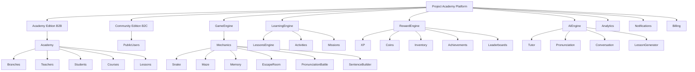

# Platform Overview

Version: 1.0

Status: Draft

Author: Project Academy Team

---

# Purpose

This document describes the high-level architecture of Project Academy.

It explains how the different platform modules interact with each other.

This is a business architecture document, not a technical implementation.

---

# Platform Overview

---

# Core Systems

Project Academy is divided into independent modules.

## Platform

Responsible for the entire ecosystem.

Includes:

- Authentication
- Multi-tenancy
- User Management
- Permissions
- Billing
- Notifications

---

## Academy Engine

Responsible for everything related to schools.

Includes:

- Academies
- Branches
- Teachers
- Students
- Courses
- Attendance
- Branding

---

## Community Engine

Responsible for public users.

Includes:

- Independent learners
- Global rankings
- Personal progression
- Community events

---

## Learning Engine

Responsible for educational content.

Includes:

- Lessons
- Activities
- Missions
- Assessments

---

## Game Engine

Responsible for gameplay.

Includes:

- Mini-games
- Game mechanics
- Difficulty scaling
- Events

---

## Reward Engine

Responsible for progression.

Includes:

- XP
- Coins
- Inventory
- Rewards
- Achievements
- Titles
- Pets

---

## AI Engine

Responsible for AI services.

Includes:

- AI Tutor
- Pronunciation
- Conversation
- Lesson Generator
- Difficulty Adjustment

---

# Architectural Principles

Project Academy follows these principles.

1. Modular Architecture.

2. Multi-tenant by design.

3. Shared game engine.

4. Independent modules.

5. Scalable infrastructure.

6. Schools own their data.

7. Community and Academy share the same platform.

8. Learning before gamification.

9. Teachers remain essential.

10. AI augments education.