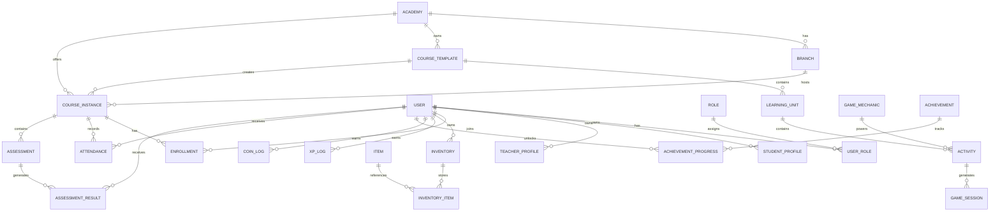

# Database Overview (ERD)

Version: 1.0

Status: Draft

---

# Purpose

This document defines the main entities of Project Academy and their relationships.

It serves as the foundation for the database design.

---

